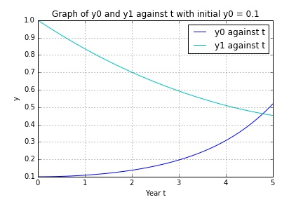

UECM3033 Assignment #3 Report
========================================================

- Prepared by: Tee Yeh Hun
- Tutorial Group: T2

--------------------------------------------------------

## Task 1 --  Gauss-Legendre formula

The reports, codes and supporting documents are to be uploaded to Github at: 

[https://github.com/Yehhun/UECM3033_assign3](https://github.com/Yehhun/UECM3033_assign3)

Explain how you implement your `task1.py` here.

The integral over [a,b] must set to [-1,1] before performing the Gaussian quadrature rule.
The interval transformation can be done in in this way below:

$$ u = T(x) = \frac{b-a}{2}x + \frac{b+a}{2} $$

$$\int_a^{b}f(x) dx= \frac{b-a}{2}\int_{-1}^{1} f(\frac{b-a}{2}x + \frac{a+b}{x} )  dx$$ 

After applying the Gaussian quadrature rule, the result in approximation as below:

$$\int_a^{b}f(x) dx= \frac{b-a}{2}\sum_{i=1}^{n} w_i f(\frac{b-a}{2}x_i + \frac{a+b}{x} ) $$

After that, the above calculation can be done by using the following code below:
z = ((b-a)*x*0.5) + ((b+a)*0.5)
ans = ((b-a)*0.5)*np.dot(w,f(z)) 

Explain how you get the weights and nodes used in the Gauss-Legendre quadrature.

$$ x_i $$ and $$ w_i $$ can be obtained using the polynomial module in python. 
The function is x,w = np.polynomial.legendre.leggauss(n)
---------------------------------------------------------

## Task 2 -- Predator-prey model

Explain how you implement your `task2.py` here, especially how to use `odeint`.
A ODE system (bio_system) is created and the following differential equations is defined in system.

$$ y'_0 = a(y_0 - y_0 y_1)$$
$$ y'_1 = b(-y_1 + y_0 y_1)$$

After that, I stored the value a,b as 1.0 and 0.2. Then for part 1, initail_y is between 0.1 and 1.0 and for part 2 as requested is between 0.11 and 1.0.

The linspace function as t = np.linspace(0,5,100) is used to plot a smooth line graph from time 0 to 5 years.

The odeint module in python, sol = odeint(bio_system,initial_y,t,args=(a, b)) is used to solve the ODE system.

Put your graphs here and explain.

The above graph shows that the number of prey, y0=0.1 and the number of predator, y1=1.0 againts Year t. Here, we can see that number of prey gradually increases when number of predetor decreases.

After changing the initial value from 0.1 to 0.11, we can see that the number of prey increases compare with previous graph.

Is the system of ODE sensitive to initial condition? Explain.

-----------------------------------

last modified: change your date here
